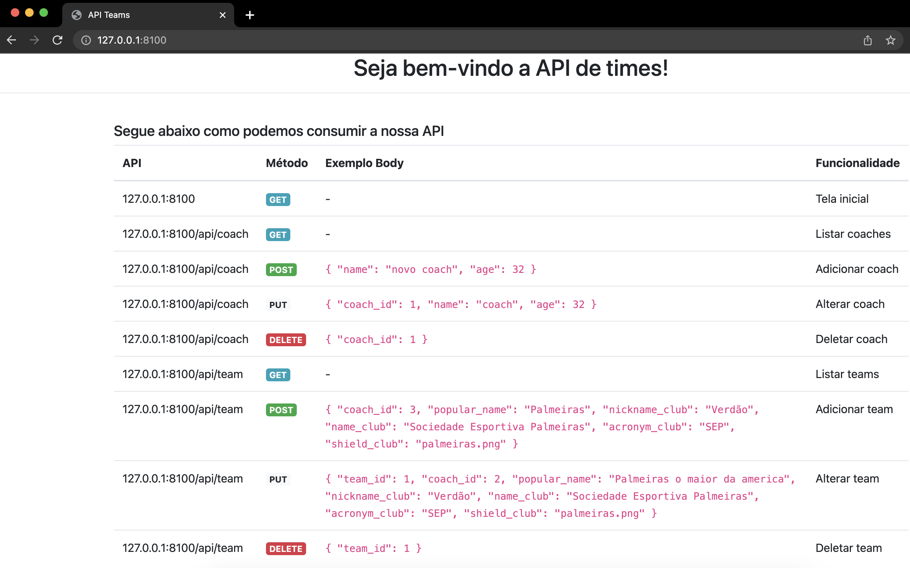

# College-microservice-teams
Microsserviço para times de um campeonato de futebol, desenvolvido em um projeto da faculdade, foi utilizado Docker para configurações de ambiente (PHP e Apache)

## Requisitos
- Docker

## Como instalar?
1. Clone esse projeto via SSH (`git clone git@github.com:Professor-Dudarts/ludus_service_teams.git`)
2. Execute `docker-compose build`
3. Execute `docker-compose up -d`

**Nota:** o servidor `MySQL` está utilizando a porta **9906** e o servidor `PHP` a porta **8100** do seu computador, certifique-se que essas portas não estão sendo usadas.

## Como utilizar a API?

**Bem simples, não? 😎**

